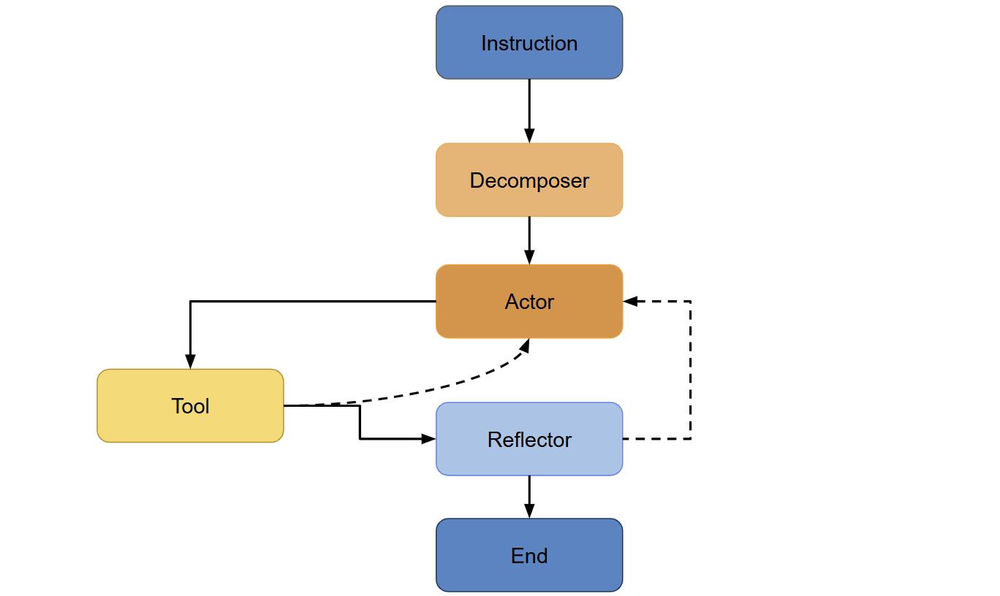

# SheetAgent-Assignment  

---

## Architecture

SheetAgent consists of the following core components:

### 1. User Instruction

- **Input:**  
  The process starts with a user-provided instruction, typically describing a set of operations to perform on an Excel file.  
  *Example: “Calculate the sum of sales per region and create a new summary sheet.”*

---

### 2. Decomposer Agent

- **Role:**  
  Receives the user instruction, as well as the **SheetState** (metadata about every sheet: number of rows, column names, types, and a snapshot of the first rows).
- **Function:**  
  Breaks down the instruction into an **ordered list of subtasks**. Each subtask represents a step required to solve the overall task.
- **Output:**  
  Structured list of subtasks, ready for execution.

---

### 3. Actor Agent

- **Role:**  
  Receives the ordered list of subtasks and context about efficient code generation.
- **Function:**  
  Generates executable Python code that solves the problem. Restricted to only a signle tool call.
- **Execution:**  
  The generated code is run in a **sandboxed interpreter** to ensure safety and isolation.
- **Error Handling:**  
  - If an error occurs during code execution, the code and error message are **cached** and **fed back** to the Actor.
  - The Actor attempts to fix the code using the feedback and resubmits for execution.
  - This loop continues until code executes successfully or the retry limit is hit.

---

### 4. Reflector Agent

- **Role:**  
  After successful code execution, the Reflector evaluates the results.
- **Inputs:**  
  Initial and current SheetState, generated code, and the list of subtasks.
- **Function:**  
  - Checks if the solution meets the requirements and if the results are reasonable (catches obvious errors, e.g., output missing, sheet not created).
  - Returns a structured output:  
    - `is_solved`: Whether the task is solved.
    - `issues`: Description of any detected problems.
- **If issues are detected:**  
  The process loops back to the Actor, providing feedback for further correction.
- **If the task is solved:**  
  The processed Excel file is saved.

---

### 5. Retry Logic

- The system tracks the number of correction attempts.
- If `max_retries` is reached and the task is still unsolved, SheetAgent returns an HTTP error indicating failure due to exceeding the retry limit.

---

## Flow Summary

1. **User submits instruction and Excel file**
2. **Decomposer** splits the task into subtasks using SheetState
3. **Actor** generates code for each subtask and attempts execution
4. On failure, code and error are looped back for correction (up to `max_retries`)
5. **Reflector** evaluates if the final output solves the problem
6. If not, feedback loops back to Actor for fixes
7. On success, the solution is saved. On persistent failure, error is reported

---

## Advantages and Disadvantages

### Advantages

* **Simplifies Prompt Creation**: By decomposing complex user instructions into clearly defined subtasks, users don't need to invest excessive time creating an elaborate, perfect prompt. Instead, a high-level, natural-language instruction is sufficient.

* **Enhanced Robustness**: Individual subtasks are easier and more straightforward for an LLM to handle, significantly reducing the likelihood of errors in generated code.

* **Efficiency in Problem-Solving**: Breaking tasks into atomic steps ensures that each step is specific, self-contained, and actionable. This facilitates solving problems reliably with a single LLM call per step, enhancing efficiency and clarity.

* **Improved Scalability**: Task decomposition is essential for upgrading the agent to handle larger-scale or highly complex problems, making the system easily scalable and adaptable to advanced scenarios.

### Disadvantages

* **Overhead**: The decomposition process itself introduces an initial overhead. 

* **Reflector Agent May Be Redundant**: The Reflector step adds an extra layer of robustness, but in practice, it can be considered overkill for straightforward tasks where the Actor already generates accurate code. This additional validation step may not always be necessary, leading to only slowing down the execution.

### Summary Notes

Overall, task decomposition significantly improves reliability and maintainability for complex Excel operations, especially beneficial in production environments or complex analyses. The Reflector Agent, while potentially redundant in simpler scenarios, serves as an additional safeguard against subtle or non-obvious errors, further strengthening robustness.

---

## Codebase Modifications 

The project structure was reorganized to:

📁 **app/**
    
    ├── 🐍 app.py  
    ├── 📁 api/  
    │   ├── 📄 __init__.py  
    │   └── 📁 endpoints/  
    │       │
    │       ├── 📄 __init__.py  
    │       ├── 📄 health.py  
    │       └── 📄 opos.py  
    ├── 📁 core/  
    │   │
    │   ├── 📄 __init__.py  
    │   ├── 📄 config.py  
    │   ├── 📄 logging_config.py  
    │   ├── 📄 prompt_manager.py  
    │   └── 📄 sandbox.py  
    ├── 📁 dataset/  
    │   │
    │   ├── 📄 __init__.py  
    │   └── 📄 dataloader.py  
    │
    ├── 📁 graph/  
    │   │
    │   ├── 📄 __init__.py  
    │   ├── 📄 chains.py  
    │   ├── 📄 graph.py  
    │   ├── 📄 nodes.py  
    │   ├── 📄 state.py  
    │   └── 📄 tools.py  
    ├── 📁 misc/  
    │   │
    │   ├── 📄 head_code.py  
    │   └── 📄 trim_code.py  
    ├── 📁 prompts/  
    │   │
    │   ├── 📄 __init__.py  
    │   ├── 📄 actor.yaml  
    │   ├── 📄 decomposer.yaml  
    │   ├── 📄 instruction.yaml  
    │   └── 📄 reflector.yaml  
    ├── 📁 services/  
    │   │
    │   ├── 📄 __init__.py  
    │   └── 📄 analysis_service.py  
    └── 📁 utils/  
        │
        ├── 📄 __init__.py  
        ├── 📄 common.py  
        ├── 📄 enumeration.py  
        ├── 📄 exceptions.py  
        ├── 📄 gcs.py  
        ├── 📄 types.py  
        └── 📄 utils.py  

* **Sandbox Modifications**:

  * The `Sandbox` class (`sandbox.py`) now loads the workbook upon object initialization rather than through a separate function call.
  * A new method was added to the `Sandbox` class, extending `get_sheet_state` to include snapshots of sheets similar to pandas `DataFrame.head()`.

* **Miscellaneous Adjustments**:

  * Files related to trimming and code snapshot functionality (`trim_code.py`, `head_code.py`) were relocated to the `misc/` directory for better clarity.

* **Dataset Adjustments**:

  * The unused `load_problem` function was removed from `dataset/dataloader.py`.

* **Prompt Management Enhancements**:

  * `prompt_manager.py` was significantly revamped, each agent chain (Decomposer, Actor, Reflector) now utilizes dedicated YAML prompt templates located in the `prompts/` folder, enhancing readability and maintainability.
  * The default user instruction template is also stored within the `prompts/` directory.

* **Graph and Chain Enhancements**:

  * The new `chains.py` file defines and composes chains for Decomposer, Actor, and Reflector.
  * `nodes.py` was refined to include the graph’s nodes and routers, aligning with the new architecture.
  * `state.py` underwent significant updates, and the state dictionary now contains additional variables relevant to the updated implementation.

* **Tool Refinement**:

  * `tools.py` was simplified to retain only essential functionality related to Python code generation, including minor adjustments for compatibility with the new implementation.

* **Graph Management**:

  * A dedicated `SheetAgentGraph` class within `graph.py` now manages graph compilation, initialization, and execution.

* **Utilities and Services Updates**:

  * A YAML-reading utility function was added to `utils.py`.
  * Minor modifications were applied to `analysis_service.py` to align with the updated project structure and enhancements.

