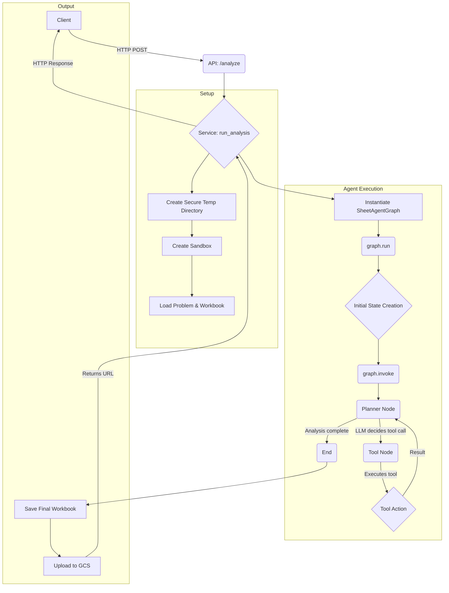

# SheetAgent
## Project Overview

SheetAgent is an innovative autonomous agent that achieves advanced spreadsheet reasoning and precise manipulation through two collaborative modules: Planner and Sandbox. It excels at handling complex real-world tasks, including those requiring multi-step reasoning and dealing with ambiguous requirements.

## Architecture

SheetAgent uses LangGraph's StateGraph for orchestrating the analysis workflow. The architecture consists of:

- **GraphState**: A state machine that maintains the workflow's state, including the problem definition, tools, and messages.
- **Nodes**: Specialized functions that handle different aspects of the analysis:
  - `planner_node`: Manages the AI agent's decision-making process
  - `tool_node`: Executes actions like Python code interpretation and reading cell ranges 
- **Edges**: Control the flow between nodes based on the agent's decisions

This architecture replaces the previous Session-based implementation with a more modular and maintainable workflow.

## Project Structure

The project follows a modern, modular structure:

```
app
├── __init__.py
├── api
│   ├── __init__.py
│   └── endpoints
│       ├── __init__.py
│       ├── health.py
│       └── opos.py
├── app.py
├── core
│   ├── __init__.py
│   ├── actions.py
│   ├── config.py
│   ├── logging_config.py
│   ├── prompt_manager.py
│   └── sandbox.py
├── dataset
│   ├── __init__.py
│   └── dataloader.py
├── graph
│   ├── __init__.py
│   ├── graph.py
│   ├── state.py
│   └── tools.py
├── prompt
│   ├── __init__.py
│   └── planner.jsonl
├── services
│   ├── __init__.py
│   └── analysis_service.py
└── utils
    ├── __init__.py
    ├── common.py
    ├── enumeration.py
    ├── exceptions.py
    ├── gcs.py
    ├── types.py
    └── utils.py
```

## Setup and Installation

SheetAgent uses Poetry for dependency management. To set up your local development environment:

1. Run the automated setup script (supports macOS and Linux):
```sh
./scripts/setup.sh
```

This script will:
- Install pyenv and Python 3.11
- Install Poetry and configure it for in-project virtualenvs
- Install all project dependencies
- Set up environment files

2. Create a `.env` file from the `.env.example` template. This file is used to store your secrets, like the `OPENAI_API_KEY`.
3. Activate the Poetry environment:
```sh
poetry shell
```

## Environment Variables

SheetAgent requires several environment variables to be set for proper operation:

### Required Environment Variables

- `OPENAI_API_KEY`: Your OpenAI API key for accessing GPT models
- `OPENAI_API_BASE`: The base URL for the OpenAI API

### Environment-Specific Variables

- `APP_ENVIRONMENT`: Determines the runtime environment (`local`, `dev`, or `prod`)
  - In `local` mode, analysis results are stored locally
  - In `dev` and `prod` modes, results are uploaded to Google Cloud Storage

### Google Cloud Storage Configuration

When running in non-local environments, the following variables are required:

- `GCS_BUCKET_NAME`: The name of the Google Cloud Storage bucket for storing analysis files
- `GOOGLE_APPLICATION_CREDENTIALS`: Path to the Google Cloud service account credentials file

### Google Cloud Secret Manager (Optional)

For secure secret management in non-local environments:

- `SECRET_PROJECT_ID`: The Google Cloud project ID for Secret Manager

## Quick Start

After setting up the environment, you can run the FastAPI server directly from the project root:

```sh
python main.py
```
Alternatively, you can use the provided script:
```sh
./scripts/run.sh
```

The server will be available at `http://127.0.0.1:8000`. You can access the API documentation at `http://127.0.0.1:8000/docs`.

## API Usage

To run an analysis, you can send a POST request to the `/opos/analyze` endpoint. For example, using `curl`:

```sh
curl -X 'POST' \
  'http://127.0.0.1:8000/opos/analyze' \
  -H 'accept: application/json' \
  -H 'Content-Type: application/json' \
  -d '{
  "workbook_url": "https://raw.githubusercontent.com/StatCan/open-data-example-file-formats/main/xlsx/example.xlsx"
}'
```

### Response Format

The response format depends on the environment:

- In `local` environment:
  ```json
  {
    "analysis_file_url": "Successfully generated analysis file to: /path/to/output/file.xlsx"
  }
  ```

- In `dev` or `prod` environments:
  ```json
  {
    "analysis_file_url": "https://storage.googleapis.com/your-bucket-name/analysis/uuid_analysis.xlsx"
  }
  ```

The processed workbook is first saved in a secure temporary directory, and in non-local environments, it's then uploaded to Google Cloud Storage for persistent storage and easy access.

For more parameter settings, you can refer to `app/services/analysis_service.py`.

## Configuration

The application uses `pydantic-settings` for robust, type-safe configuration management. All configuration is centralized in the `SheetAgentSettings` class within `app/core/config.py`.

For local development, create a `.env` file in the project root. A `.env.example` file is provided as a template for all required variables.

The application's behavior is controlled by the `APP_ENVIRONMENT` variable:
- **`local` (default)**: Settings are loaded primarily from the `.env` file. This is the standard mode for local development.
- **`dev` / `prod`**: Settings are loaded from environment variables, with secrets being fetched securely from Google Cloud Secret Manager. For this to work, the `SECRET_PROJECT_ID` environment variable must be set to your Google Cloud project ID.

## Running with Docker

SheetAgent can be easily run using Docker and Docker Compose. Follow these steps to get started:

1. Create a `.env` file in the project root with the following required environment variables:
   ```
   # Application Environment
   APP_ENVIRONMENT=local
   
   # OpenAI API Configuration (Required)
   OPENAI_API_BASE=https://api.openai.com/v1
   OPENAI_API_KEY=your_openai_api_key_here
   
   # Sandbox Directory (Used by Docker)
   SANDBOX_BASE_DIR=/app/sandbox
   ```

2. If you need Google Cloud Storage integration, create a `credentials.json` file with your GCP service account key in the project root.

3. Build and start the Docker containers:
   ```sh
   docker-compose build
   docker-compose up -d
   ```

4. The API will be available at `http://localhost:56743/docs`.

5. To stop the containers:
   ```sh
   docker-compose down
   ```

### Docker Configuration Details

- The application runs in a secure container with a non-root user.
- The sandbox directory is mounted as a volume for persistent storage between container restarts.
- For development, source code is mounted for hot reloading (uncomment the relevant lines in docker-compose.yml).
- Environment variables are loaded from your `.env` file.

## Dependencies

SheetAgent uses LangGraph (built on LangChain) for workflow orchestration. This provides a more modular and maintainable architecture compared to the previous implementation.

## External Services

To use the SheetAgent with external services, you may need:

- **OpenAI API**: Required for the AI agent functionality
- **Google Cloud Storage**: Used in non-local environments for storing analysis results
- **Google Cloud Secret Manager**: Optional for secure secret management in non-local environments

# SheetAgent Architecture

This document outlines the architecture of SheetAgent, a Python-based AI agent for spreadsheet analysis.

## Core Components

The application is structured into several key components that work together to process user requests, analyze data, and generate results.

-   **API Layer (`app/api/endpoints/opos.py`)**: The entry point of the application, handling incoming HTTP requests.
-   **Service Layer (`app/services/analysis_service.py`)**: Orchestrates the entire analysis workflow.
-   **Agent Core (`app/graph/graph.py`)**: The central agent logic, implemented using LangGraph.
-   **Agent State (`app/graph/state.py`)**: Defines the state that is passed between different steps of the agent's execution.
-   **Tools (`app/graph/tools.py`)**: A collection of functions that the AI agent can call to interact with its environment (e.g., execute code, read data).
-   **Action Executors (`app/core/actions.py`)**: The backend implementation for the tools, performing the actual work.
-   **Sandbox (`app/core/sandbox.py`)**: A secure environment for file operations and code execution.

## Execution Flow

The analysis process follows a clear, sequential flow from receiving a request to returning a result.



### 1. API Request (`opos.py`)

-   A user sends a `POST` request to the `/analyze` endpoint with a workbook URL and an instruction prompt.
-   The FastAPI router receives the request and calls the `run_analysis` function from the analysis service.

### 2. Service Orchestration (`analysis_service.py`)

-   `run_analysis` sets up a secure, temporary directory for all file operations.
-   It initializes a `Sandbox` instance, which constrains all file I/O and code execution to this temporary directory.
-   It downloads the user's workbook into the sandbox.
-   It instantiates the `SheetAgentGraph`, which encapsulates the core AI logic.
-   It triggers the agent by calling `agent_graph.run()`.
-   Once the agent finishes, the service uploads the resulting modified workbook to Google Cloud Storage and returns the public URL to the client.

### 3. Agent Core (`graph.py`, `state.py`)

-   The agent's intelligence is built using **LangGraph**, a framework for creating stateful, multi-actor applications with LLMs.
-   The central component is a `StateGraph` object defined in `build_graph`.
-   **Graph State (`state.py`)**: The `GraphState` is a TypedDict that holds all information for an execution run. This includes static data like the `Sandbox` instance and dynamic data like the `messages` history and the current `step`.
-   **Nodes**: The graph consists of two main nodes:
    1.  **Planner Node (`planner_node`)**: This is the "brain" of the agent. It calls a Large Language Model (in this case, from OpenAI) with the current conversation history and an observation of the spreadsheet's state. The LLM's response can be a natural language message or a request to use a tool.
    2.  **Tool Node**: When the planner decides to use a tool, this node executes it. LangGraph's `ToolNode` automatically routes to the correct tool and executes it.
-   **Edges**: The control flow is defined by edges:
    -   The graph always starts at the `planner`.
    -   After the `planner` thinks, if it decides to call a tool, control moves to the `tools` node.
    -   After a tool is executed, control always returns to the `planner` so it can assess the result and decide what to do next.
    -   This loop continues until a maximum number of steps is reached or the planner decides the task is complete, at which point the graph execution ends.

### 4. Tools and Actions (`tools.py`, `actions.py`)

-   **Tools (`tools.py`)**: These are LangChain `@tool`-decorated functions that define the agent's capabilities. They act as wrappers around the `ActionExecutor` classes. Examples include `python_executor` and `cell_range_reader`. These functions are what the LLM "sees" and calls. They are responsible for extracting arguments from the LLM call and passing them to the underlying action executors.
-   **Action Executors (`actions.py`)**: These classes contain the actual logic for performing tasks.
    -   `PythonInterpreter`: Executes Python code within the `Sandbox`.
    -   `SheetSelector`: Converts spreadsheet data into an in-memory SQLite database and allows for querying it with SQL.
    -   `AnswerSubmitter`: A mechanism for the agent to signal it has finished its work.

This modular architecture separates concerns, enhances security through sandboxing, and leverages LangGraph to create a robust, stateful AI agent.
